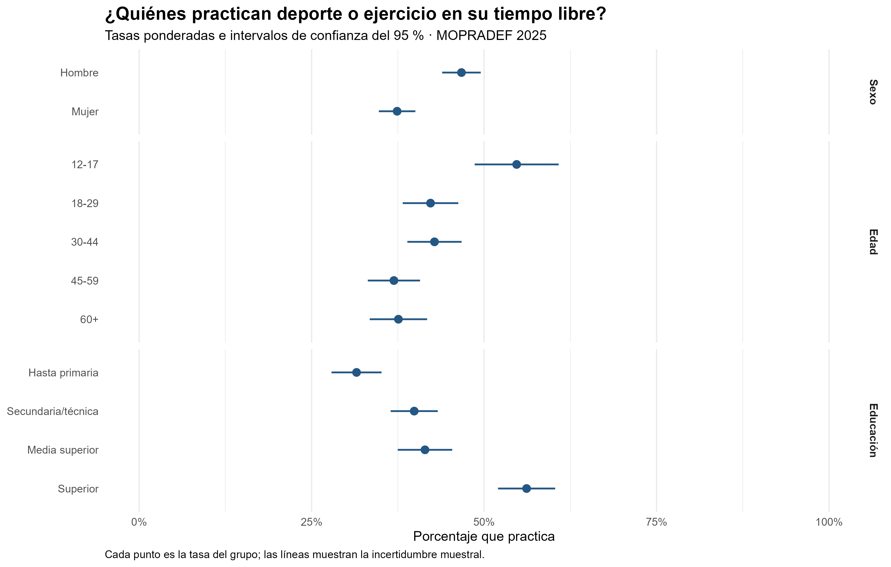
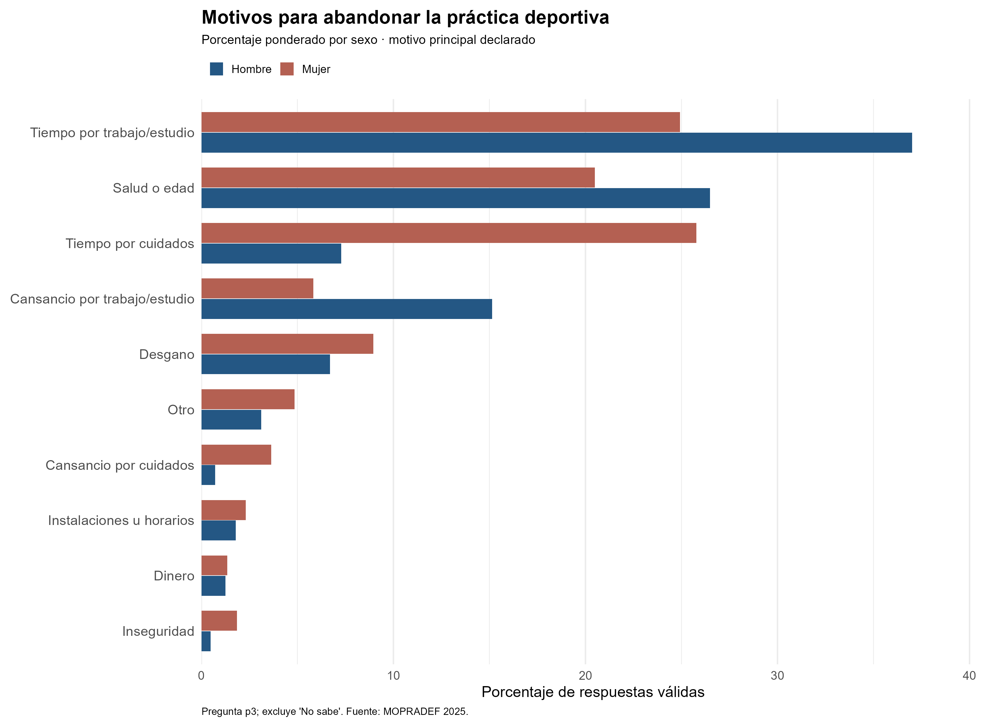
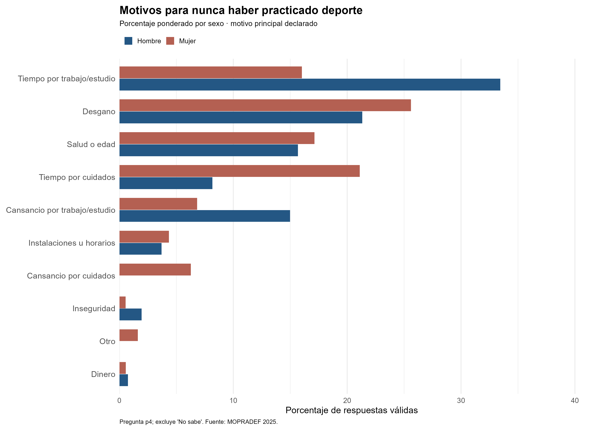
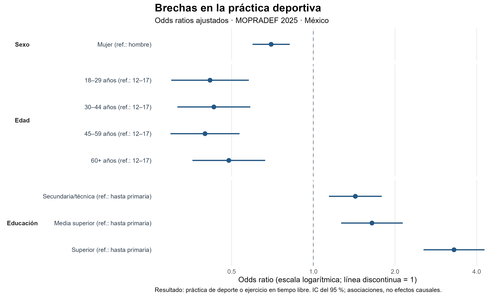
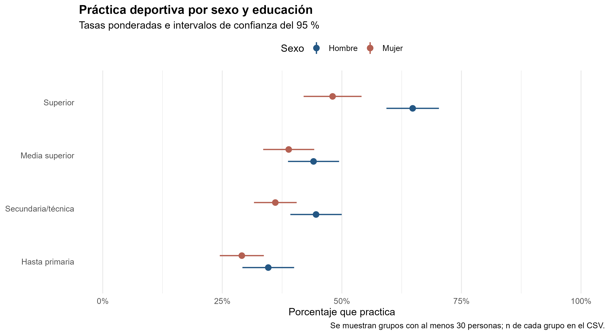
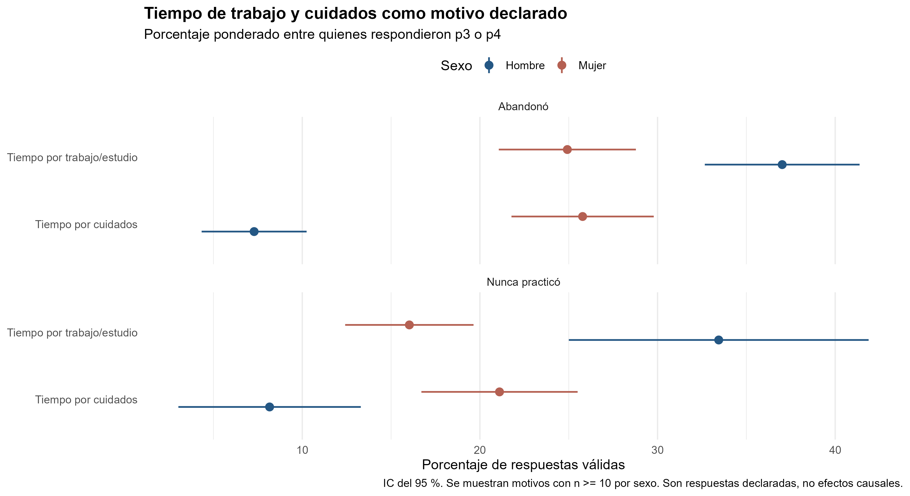

# Análisis de la práctica deportiva en México (MOPRADEF 2025)

## 📌 Presentación del proyecto

Este repositorio contiene un análisis reproducible en **R** de los microdatos del [Módulo de Práctica Deportiva y Ejercicio Físico (MOPRADEF) 2025](https://www.inegi.org.mx/programas/mopradef/) del INEGI.

La pregunta principal es: **¿Cómo varía la práctica deportiva según el sexo, la edad y la educación en México, y qué motivos declaran quienes la abandonaron o nunca la iniciaron?**

El proyecto combina estadística descriptiva, visualización de datos y un modelo de regresión logística. Desde la Economía del Desarrollo, busca identificar brechas relevantes para formular preguntas de política pública.

---

## 🛠️ Organización del análisis

| Script | Función |
| --- | --- |
| `01_Carga_y_Limpieza_MOPRADEF.R` | Carga los microdatos, valida las variables y crea la base analítica. |
| `02_Analisis_Descriptivo_MOPRADEF.R` | Calcula tasas ponderadas y tablas de motivos declarados. |
| `03_Graficos_Descriptivos_MOPRADEF.R` | Genera los gráficos de tasas y motivos. |
| `04_Modelado_MOPRADEF.R` | Estima una regresión logística y genera un gráfico de *odds ratios*. |
| `05_Desigualdades_y_Tiempo_MOPRADEF.R` | Examina el cruce entre sexo y educación, así como motivos relacionados con trabajo y cuidados. |

Los scripts emplean el factor de expansión de la persona elegida (`fac_ele`), la unidad primaria de muestreo (`upm_dis`) y el estrato (`est_dis`) para incorporar el diseño de la encuesta.

---

## 📂 Estructura del proyecto

```text
Data/
  mopradef_bd_2025_sav/
    MOPRADEF.sav
  analisis_df.rds

Scripts/
  01_Carga_y_Limpieza_MOPRADEF.R
  02_Analisis_Descriptivo_MOPRADEF.R
  03_Graficos_Descriptivos_MOPRADEF.R
  04_Modelado_MOPRADEF.R
  05_Desigualdades_y_Tiempo_MOPRADEF.R

Output/
  02_*.csv
  03_*.png
  04_*.csv / *.png / *.pdf / *.rds
  05_*.csv / *.png
```

`analisis_df.rds` es generado por el script 01. Los archivos de `Output/` se generan al ejecutar los análisis.

---

## ▶️ Cómo reproducir el proyecto

Abre el archivo `.Rproj` desde la carpeta principal del proyecto. Coloca `MOPRADEF.sav` en `Data/mopradef_bd_2025_sav/` e instala los paquetes necesarios:

```r
install.packages(c("haven", "dplyr", "survey", "ggplot2", "readr", "scales"))
```

Después, ejecuta los scripts en este orden:

```r
source("Scripts/01_Carga_y_Limpieza_MOPRADEF.R")
source("Scripts/02_Analisis_Descriptivo_MOPRADEF.R")
source("Scripts/03_Graficos_Descriptivos_MOPRADEF.R")
source("Scripts/04_Modelado_MOPRADEF.R")
source("Scripts/05_Desigualdades_y_Tiempo_MOPRADEF.R")
```

Si R no encuentra `Data/`, comprueba la carpeta activa con `getwd()`.

---

## 📊 Resultados descriptivos

La base contiene **4.240 personas elegidas**. En la muestra sin ponderar, **1.738** declararon que practican deporte o ejercicio físico en su tiempo libre y **2.502** que no practican. Las tasas presentadas en los gráficos se estiman **con ponderación**, por lo que no deben calcularse dividiendo directamente esos conteos.

### Práctica deportiva por grupo

La siguiente figura presenta las tasas estimadas por sexo, edad y educación. Cada punto indica un porcentaje y la línea a su alrededor representa su intervalo de confianza del 95 %.



### Motivos declarados para abandonar la práctica

Este gráfico se refiere únicamente a quienes **practicaron anteriormente y abandonaron**. Los porcentajes se calculan dentro de las respuestas válidas de hombres y mujeres por separado.



### Motivos declarados por quienes nunca practicaron

Este segundo gráfico corresponde a quienes **nunca han practicado**. Se presenta por separado porque responde a otra pregunta de la encuesta y tiene un denominador distinto.



---

## 📈 Asociaciones ajustadas

El script 04 estima una regresión logística que relaciona la práctica deportiva con sexo, edad y educación. El siguiente *forest plot* muestra los **odds ratios ajustados** y sus intervalos de confianza del 95 %.

La línea vertical en **1** representa ausencia de diferencia respecto al grupo de referencia. Un punto a la izquierda indica menores *odds* y uno a la derecha indica mayores *odds*. **Un odds ratio no es un porcentaje de personas que practican deporte.**



---

## 🔎 Sexo, educación y uso del tiempo

El script 05 profundiza en dos preguntas:

1. ¿Cómo varía la práctica deportiva cuando se observan **sexo y educación conjuntamente**?
2. ¿Con qué frecuencia se declara la falta de tiempo por **trabajo o estudio** o por **cuidados** como motivo principal?





Las tablas CSV incluyen tamaños de muestra e intervalos de confianza. Antes de interpretar una diferencia pequeña o un subgrupo, conviene revisar esos datos.

---

## 🏛️ Lectura para política pública

El análisis permite **identificar grupos y motivos que merecen atención**, pero no demuestra que una característica cause la práctica o la falta de práctica deportiva.

Las diferencias observadas pueden orientar preguntas para el diseño de políticas: ¿los horarios de las actividades son compatibles con el trabajo y el estudio?, ¿qué obstáculos enfrentan quienes realizan tareas de cuidado?, ¿cambian las necesidades entre grupos educativos?

Los motivos de la encuesta son **respuestas declaradas**. Para comprender mejor las experiencias detrás de esas respuestas sería útil complementar los resultados con entrevistas u otros métodos cualitativos. Para afirmar que una intervención funciona se necesitaría, además, una evaluación específica.

---

## ⚠️ Alcances y limitaciones

- Se analiza un levantamiento de **2025**; los resultados no muestran cambios a lo largo del tiempo.
- El resultado principal es la **práctica declarada de deporte o ejercicio en tiempo libre**. No equivale automáticamente a cumplir recomendaciones de actividad física.
- Las respuestas «No sabe» se excluyen de los gráficos de motivos; los porcentajes se calculan entre respuestas válidas.
- `p3` estudia el **abandono** y `p4` la **ausencia de práctica previa**. Sus porcentajes no comparten el mismo denominador.
- Las estimaciones del modelo son **asociaciones observacionales**, no efectos causales.
- Los análisis de grupos pequeños deben interpretarse con cautela.

---

## 📚 Fuente

**INEGI.** [Módulo de Práctica Deportiva y Ejercicio Físico (MOPRADEF) 2025](https://www.inegi.org.mx/programas/mopradef/).

El procesamiento de los microdatos, las agrupaciones de variables, los gráficos y la interpretación de este repositorio son elaboración propia; **no son resultados oficiales del INEGI**.
Arturo Gonzalez Romero
